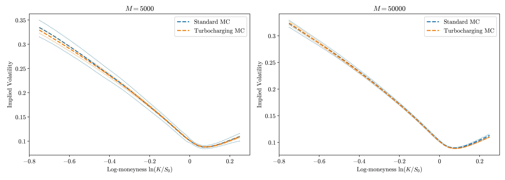
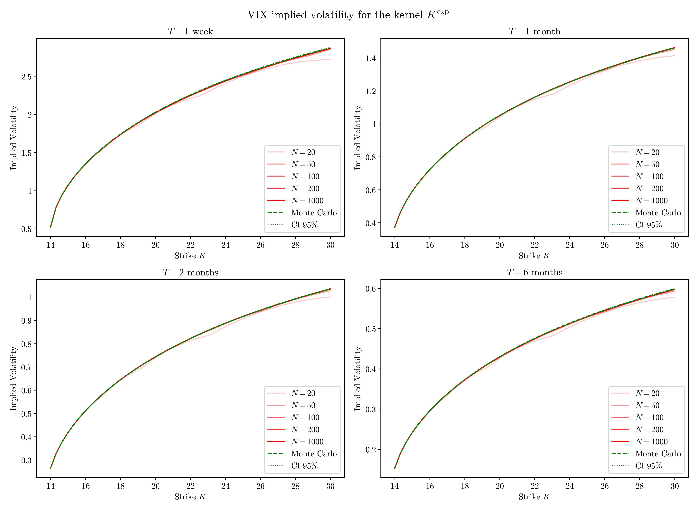

### Joint SPX/VIX calibration problem with the quintic OU model 

This repository reproduces the results of [Abi Jaber, Illand and Li (2023)](https://arxiv.org/pdf/2212.10917). 

We implement:
- an optimal quantization-based approach to compute expectations of VIX functionals (see `quantization_VIX`),
- the so-called turbocharging method introduced in [McCrickerd, and Pakkanen (2018)](https://arxiv.org/pdf/1708.02563) to drastically reduce the variance in SPX implied volatility computations (see `turbocharging.ipynb`), 
- joint SPX/VIX calibration using a parametric forward variance curve (see `calibration_parametric_xi.ipynb`),
- joint SPX/VIX calibration using the market forward variance curve, obtained via Carr-Madan stripping (see `genuine_calibration.ipynb`).

**Note 1:** Model parameters are calibrated using a two-stage optimization procedure combining Differential Evolution (DE) and a multi-start Nelder–Mead (NM) algorithm. DE is first used to perform a global exploration of the parameter space within prescribed bounds, which is well suited to the non-convex and noisy nature of the calibration objective. Local refinement is then carried out by initializing several Nelder–Mead runs from the best candidates of the final DE population, and the final calibrated parameters are selected as the best solution among all local optimizations.

**Note 2:** We compare the performance of the (markovian) exponential kernel $K^\text{exp}$ with the fractional and shifted kernels $K^\text{frac}$ and $K^\text{shift}$, as illustrated in [Abi Jaber, Illand and Li (2024)](https://arxiv.org/pdf/2212.08297). 

### Examples of illustrations

### Disclaimer

Full source code is avaible upon requests. Please contact me directly. Due to licensing restrictions, the raw data cannot be publicy released.